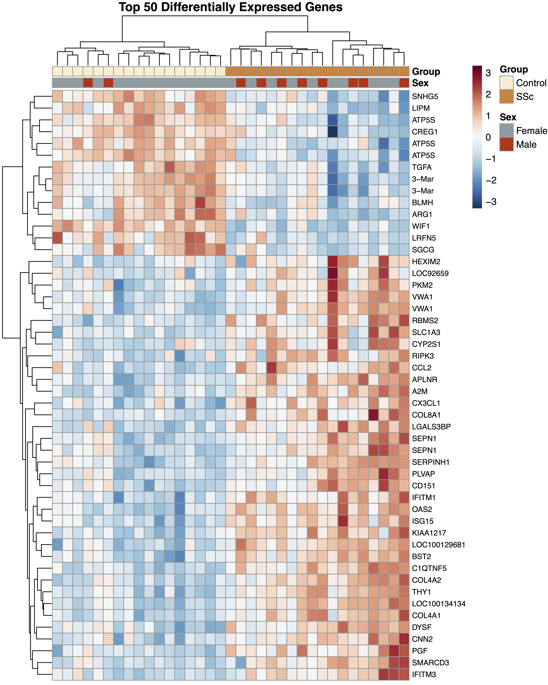
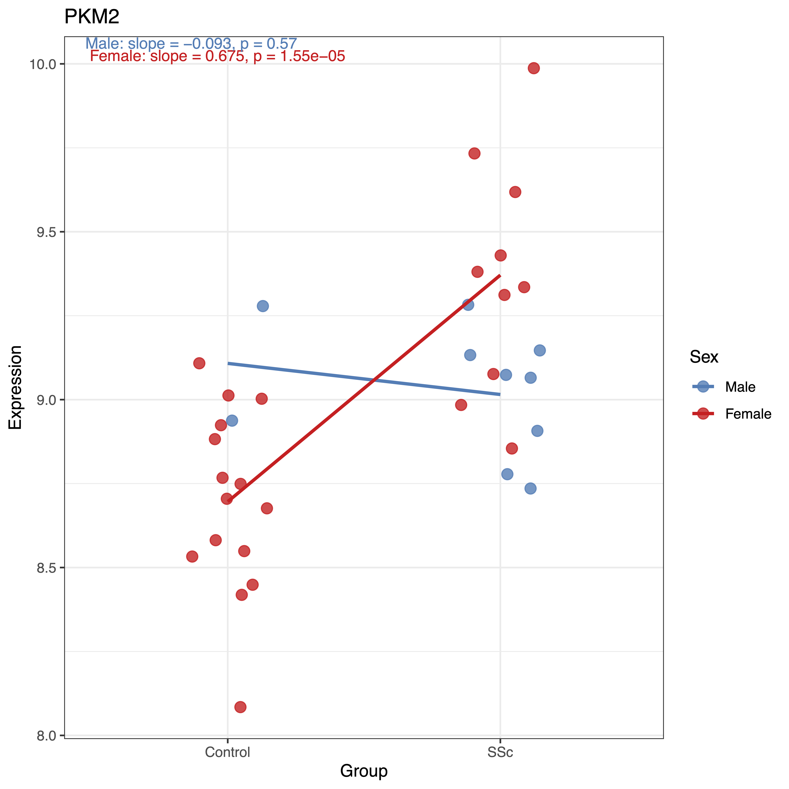
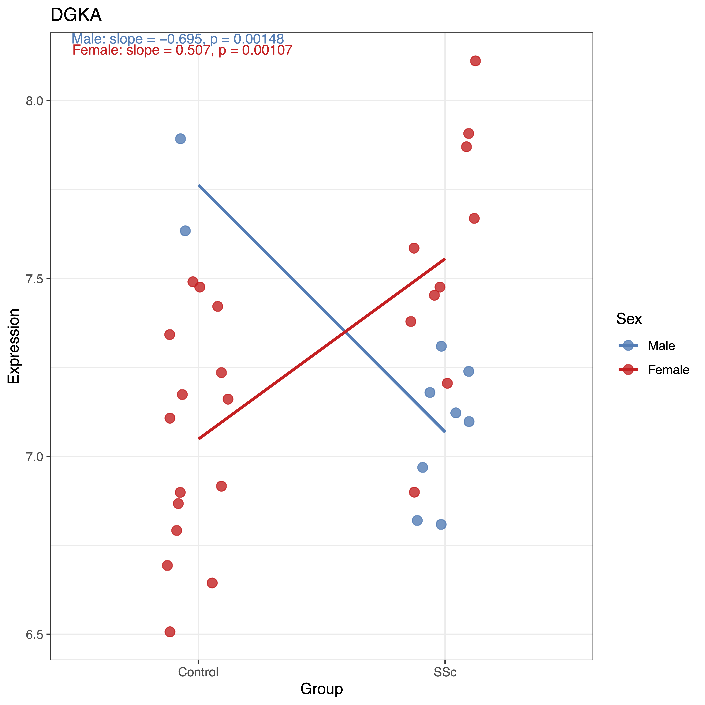

# Systemic Sclerosis Transcriptomic Analysis

## Investigating Disease-Relevant Sex-Specific Differences in Diffuse Systemic Sclerosis

**Contributors:** Aidan Moore, Mason Matich, Dagim Haile

---

## Overview

This repository contains reanalysis scripts for investigating sex-specific transcriptomic differences in patients with Diffuse Systemic Sclerosis (SSc). The project analyzes two independent datasets to identify disease-relevant, sex-specific gene expression patterns that may contribute to understanding the observed clinical differences between male and female SSc patients.

## Background

### What is Systemic Sclerosis?

Systemic Sclerosis is an umbrella term covering a group of rare autoimmune diseases characterized by:
- Hardening and tightening of the skin
- Classification as either limited or diffuse based on degree of skin involvement
- Higher risk for internal organ damage in diffuse SSc
- **No known cure**

### Clinical Motivation

The study of sex-specific differences in SSc is motivated by striking epidemiological observations:
- **3:1 female to male ratio** in disease prevalence
- Males often present with **more severe prognosis** despite lower incidence
- Understanding sex-specific mechanisms may inform personalized treatment approaches

## Research Question

**Are there sex-specific transcriptomic differences in males and females with systemic sclerosis that are disease-relevant?**

### Hypothesis

If sex has a significant influence in disease manifestation in Systemic Sclerosis patients, then there will be distinct transcriptomic profiles between sexes that are specific to the disease state.

---

## Datasets

### 1. Microarray Analysis (GSE58095)

**Platform:** Illumina HumanHT-12 V4.0 expression beadchip  
**Sample Type:** Skin biopsies (affected skin for SSc samples)  
**Cohort Size:** 35 individuals
**Disease Characteristics:** Diffuse SSc patients (some with Interstitial Lung Disease - representing more severe cases)

| Group | Male | Female |
|-------|------|--------|
| Healthy | 2 | 15 |
| SSc | 8 | 10 |

**Sex Distribution:**
- Limited male controls (n=2) presented a statistical challenge for interaction analysis

**Reference:**  
Farutin, V., Kurtagic, E., Pradines, J.R. et al. Multiomic study of skin, peripheral blood, and serum: is serum proteome a reflection of disease process at the end-organ level in systemic sclerosis? *Arthritis Res Ther* 23, 259 (2021). https://doi.org/10.1186/s13075-021-02633-5

### 2. Bulk RNA-Seq Analysis (GSE130955)

**Sample Type:** Skin biopsies  
**Disease Stage:** Early Diffuse SSc  
**Cohort Size:** 91 patients

| Group | Male | Female |
|-------|------|--------|
| Healthy | 11 | 22 |
| SSc | 23 | 35 |

---

## Methods

### Microarray Analysis (GSE58095_limma_DE.Rmd)

1. **Differential Expression Analysis:** Identified disease-relevant differentially expressed genes (DEGs) using limma
2. **Sex-Stratified Visualization:** Plotted normalized expression for each sample against disease state, colored by sex
3. **Pattern Recognition:** Classified genes as:
   - Disease-relevant, NOT sex-specific
   - Disease-relevant, AND sex-specific
   - NOT disease-relevant

**Limitation:** Due to limited male controls (n=2), limma's differential expression analysis could not identify significant DEGs by interaction effect.

### Bulk RNA-Seq Analysis

**Strategy to Isolate Disease-Relevant Sex Differences:**

1. Compare Control Male vs Female → Identify baseline sex DEGs
2. **Remove** these inherent biological sex differences from the count matrix
3. Compare SSc Male vs Female on filtered data
4. Remaining DEGs represent **disease-specific** sex differences

This approach removes inherent biological genetic differences between sexes (e.g., Y-chromosome linked genes) to focus on disease-relevant patterns.

**Analysis confirmed successful filtering:** Y-axis scale differences in volcano plots showed effective removal of baseline sex DEGs in control comparisons.

---

## Key Findings

### Microarray Results
- Identified disease-relevant DEGs in Diffuse SSc
  
| SSc DEGs |
|:---------------:|
|  |

- Visual inspection revealed two candidate genes showing potential sex-specific disease patterns
  
| PKM2 Expression | DGKA Expression |
|:---------------:|:---------------:|
|  |  |

- Statistical confirmation limited by sample size constraints

### RNA-Seq Results
- Successfully identified top 30 genes differentially expressed between SSc males and females
- Genes predominantly **up-regulated in female patients** and **down-regulated in males**
- Heat maps demonstrate clear clustering patterns by sex within SSc patients

### Cross-Dataset Validation
Parallel analysis identified **one overlapping gene: AGR3**
- Limited overlap suggests dataset-specific technical factors or biological heterogeneity
- AGR3's role in SSc not well-supported by current literature

---

## Repository Structure

```
systemic_sclerosis_transcriptomic_analysis/
├── GSE58095_limma_DE.Rmd          # Microarray differential expression analysis
├── Skaug2018.ipynb                # RNA-Seq analysis notebook
├── Bulk RNA Seq - Python/         # Python scripts for RNA-Seq processing
└── README.md                       # This file
```

---

## Future Directions

- Expand sample sizes, particularly male controls in microarray dataset
- Perform functional enrichment analysis on sex-specific DEGs
- Validate findings in independent SSc cohorts
- Investigate molecular mechanisms underlying sex-specific gene expression
- Explore potential therapeutic targets based on sex-stratified profiles

---

## Limitations

### Technical Challenges
- **PyDESeq limitations:** Could compare males and females but lacked functionality to remove baseline sex DEGs as implemented in our filtering approach
- **Python expertise:** Limited Python knowledge created implementation barriers

### Statistical Challenges
- Small male control group (n=2) in microarray dataset prevented robust interaction analysis
- Limited overlap between datasets suggests need for larger validation cohorts

---

## Acknowledgements

**Research Support:**  
Special thanks to Phyllis Yale and Tucker Taft for providing this research opportunity.

**Instructors and Mentors:**
- Laura Muller
- Morgan Sanders
- Dani Presgraves
- Seamus Mawe
- Dan Getti
- Tuan Nguyen
- Lucie Hutchins
- Ella Von Dohlen
- Sam Bigalke

**Peer Support:**
- Abby H. (tutorials and code assistance)
- Chris (workflow tools)
- Maya & Wimeth (resources and conceptual guidance)
- Chi (code troubleshooting)
- Abby L. (project support)
- Claude AI (coding assistance)

---

## References

1. Mayo Clinic. (2019). Scleroderma - Symptoms and causes. https://www.mayoclinic.org/diseases-conditions/scleroderma/symptoms-causes/syc-20351952

2. Peoples, C., Medsger, T. A., Jr, Lucas, M., Rosario, B. L., & Feghali-Bostwick, C. A. (2016). Gender differences in systemic sclerosis: relationship to clinical features, serologic status and outcomes. *Journal of scleroderma and related disorders*, 1(2), 177–240. https://doi.org/10.5301/jsrd.5000209

3. Farutin, V., Kurtagic, E., Pradines, J.R. et al. (2021). Multiomic study of skin, peripheral blood, and serum: is serum proteome a reflection of disease process at the end-organ level in systemic sclerosis? *Arthritis Res Ther* 23, 259. https://doi.org/10.1186/s13075-021-02633-5

---

## Contact

For questions or collaboration inquiries, please open an issue in this repository.

## License

This project is available for academic and research purposes.
